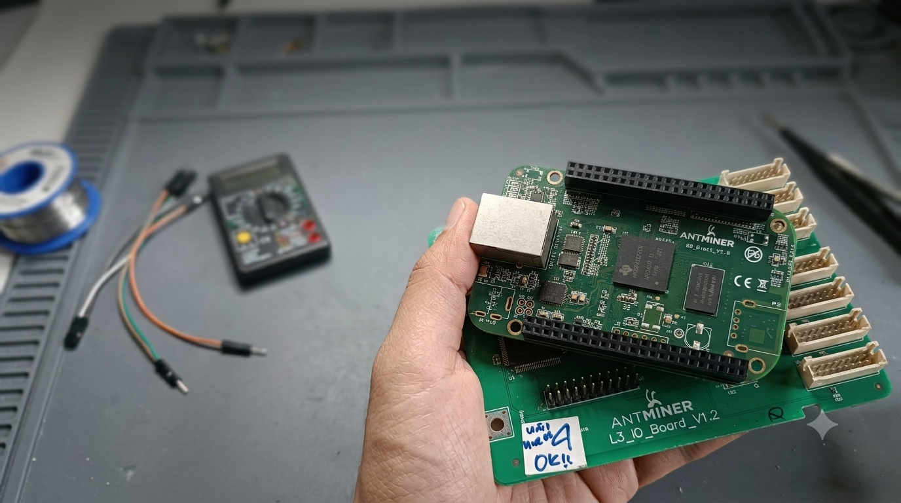

# AM335x FreeRTOS StarterWare Project

<p align="center">
  
</p>

> **Hardware Target:** This project is targeted at the **Antminer L3+** mining board, which uses the **TI AM3352** (ARM Cortex-A8) SoC. The PCB form factor is roughly similar to the BeagleBone Black / AM3356, **but without the PRU subsystems**. This makes the Antminer L3+ a **low-cost option to repurpose** retired mining hardware as a learning platform for FreeRTOS on TI's Cortex-A stack. The banner image above is the Antminer L3+ board itself.

<p align="center">
  <strong>A FreeRTOS port for the TI AM3352 (Cortex-A8), built with CMake + GCC ARM, flashable via J-Link GDB Server.</strong>
</p>

<p align="center">
  
  
  
  
  
  
</p>

---

## Overview

This repository contains a **FreeRTOS port** for the TI AM3352 SoC. It uses:

- **GNU ARM GCC 7.3.1** (`gcc-arm-none-eabi-7-2018-q2-update`)
- **CMake 3.11+** with Ninja generator
- **J-Link GDB Server** for flashing and debugging

The FreeRTOS kernel is based on Amazon FreeRTOS v10.2.0, adapted from the Cortex-A9 GIC port to use TI's **AINTC** (Advanced Interrupt Controller). Peripheral drivers come from TI's **StarterWare 02.00.01.01** package.

No SD card or external bootloader is required — the binary runs directly from DDR via JTAG.

---

## Prerequisites

| Component | Version / Detail |
|---|---|
| GNU ARM GCC | **7.3.1** (`gcc-arm-none-eabi-7-2018-q2-update`) — must be at `C:\ti\gcc-arm-none-eabi-7-2018-q2-update\bin\arm-none-eabi-gdb.exe` |
| CMake | **3.11+** (tested up to 4.x) |
| Ninja | Build system generator |
| Python | 2.x or 3.x (for CMake config script) |
| Target Board | **Antminer L3+** (TI AM3352, Cortex-A8) — repurposed mining hardware |
| Emulator / Debugger | **J-Link** — solder a JTAG cable onto the Antminer L3+ board. The JTAG footprint is on the rear edge, same as the BeagleBone Black. Follow the [BBB JTAG soldering tutorial](https://dr-kino.github.io/2020/07/22/Beaglebone-black-soldering-jyag-connector/). |

> **Note on compatibility:** The AM3352 shares the same ARM Cortex-A8 core as the BeagleBone Black (AM335x). However, the AM3352 **does not include the PRU subsystems**. Any code that depends on PRU will not work — stick to GPIO, UART, Timer, MMCSD, I2C, SPI, and Ethernet peripherals.

---

## Getting Started

### Quick Summary

1. **Install GNU ARM GCC 7.3.1** and place it at `C:\ti\gcc-arm-none-eabi-7-2018-q2-update`.
2. **Place third-party libraries** (`lib/third_party/ti/` and `lib/third_party/amazon/`) inside your project folder.
3. **Generate CMake config** by running the included Python script.
4. **Configure and build** with CMake + Ninja using the provided toolchain file.
5. **Flash via J-Link GDB Server** to run on the Antminer L3+.

Full step-by-step instructions are in each project's folder under [`Examples/`](./Examples/).

---

## Example Projects

All examples live under the [`Examples/`](./Examples/) folder.

### FreeRTOS Examples

- 🟧 [**`Examples/FreeRTOS_AM335x_GPIO_LED/`**](./Examples/FreeRTOS_AM335x_GPIO_LED/) — **Minimal FreeRTOS port** on AM3352. Runs two LED blink tasks (GPIO1[23] + GPIO1[24]) on FreeRTOS with AINTC-based tick timer. Built with CMake, flashed via JTAG.

- 🔘 [**`Examples/FreeRTOS_AM335x_GPIO_INTERRUPT/`**](./Examples/FreeRTOS_AM335x_GPIO_INTERRUPT/) — **GPIO interrupt demo** on AM3352. A pushbutton on P9_12 fires an AINTC edge interrupt that speeds up the on-board LED D2 blink rate.

- ⚙️ [**`Examples/FreeRTOS_AM335x_Task_Management/`**](./Examples/FreeRTOS_AM335x_Task_Management/) — **Task management demo** on AM3352. Demonstrates `vTaskSuspend`/`vTaskResume`, cross-task `vTaskDelete`, and the idle hook via UART logging.

- 🔀 [**`Examples/FreeRTOS_AM335x_Task_Scheduler/`**](./Examples/FreeRTOS_AM335x_Task_Scheduler/) — **Scheduler & task priority demo** on AM3352. Three tasks demonstrate preemptive/cooperative scheduling, time slicing, and context switching, all observable via UART logging.

- ⏱️ [**`Examples/FreeRTOS_AM335x_Task_Timing/`**](./Examples/FreeRTOS_AM335x_Task_Timing/) — **Task delay & timing demo** on AM3352. Demonstrates `vTaskDelayUntil` (drift-free periodic), `vTaskDelay` (relative), and a software timer via UART logging.

- 📬 [**`Examples/FreeRTOS_AM335x_Queue/`**](./Examples/FreeRTOS_AM335x_Queue/) — **Queue-based task communication demo** on AM3352. Producer-Consumer pattern over a FIFO queue: `xQueueSend()`/`xQueueReceive()`, queue length (`uxQueueMessagesWaiting`/`uxQueueSpacesAvailable`), and blocking on both empty and full queues via UART logging.

- 🔐 [**`Examples/FreeRTOS_AM335x_Semaphore/`**](./Examples/FreeRTOS_AM335x_Semaphore/) — **Synchronization primitives demo** on AM3352. Six phases covering binary & counting semaphores, ISR semaphore (given from the tick hook), event notifications (`xTaskNotifyGive`/`ulTaskNotifyTake`), task synchronization (rendezvous), and task lifecycle via UART logging.

- 🔒 [**`Examples/FreeRTOS_AM335x_Mutex/`**](./Examples/FreeRTOS_AM335x_Mutex/) — **Mutex & resource protection demo** on AM3352. Demonstrates mutexes, recursive mutexes, priority inheritance (priority inversion prevention), critical sections (`taskENTER_CRITICAL`), and UART peripheral protection via UART logging.

---

## Folder Layout

```
AM335x-FreeRTOS-Project/
├── README.md                  ← you are here
├── .gitignore
├── Doc/
│   └── bg.png                 ← banner image
└── Examples/                  ← all portable examples live here
    ├── FreeRTOS_AM335x_GPIO_LED/    ← FreeRTOS bare-metal port for AM3352 (LED blink tasks)
    ├── FreeRTOS_AM335x_GPIO_INTERRUPT/  ← FreeRTOS GPIO interrupt demo (button → LED speed)
    ├── FreeRTOS_AM335x_Task_Management/ ← FreeRTOS task management demo (suspend/resume/delete)
    ├── FreeRTOS_AM335x_Task_Scheduler/  ← FreeRTOS scheduler & priority demo (preemption/time slicing)
    ├── FreeRTOS_AM335x_Task_Timing/     ← FreeRTOS task delay & timing demo (vTaskDelayUntil/timer)
    ├── FreeRTOS_AM335x_Queue/           ← FreeRTOS queue task-communication demo (producer/consumer)
    ├── FreeRTOS_AM335x_Semaphore/       ← FreeRTOS sync primitives demo (binary/counting/ISR/notify/sync)
    └── FreeRTOS_AM335x_Mutex/           ← FreeRTOS mutex & resource protection demo (priority inheritance)
```

---

## Special Thanks

This repository's FreeRTOS port was bootstrapped from the work in [`kryochronic/AM335X-FreeRTOS-lwip`](https://github.com/kryochronic/AM335X-FreeRTOS-lwip). Thanks to the original author for the foundational AM3352 FreeRTOS port.

---

## License & Credits

This project contains code from:
- **FreeRTOS** — MIT licensed
- **TI StarterWare** — Texas Instruments BSD-style license
- **Amazon FreeRTOS** — Apache License 2.0

See individual files for specific license text.

<p align="center"><sub>Built for the Antminer L3+ (AM3352) • Powered by FreeRTOS v10.2.0 + StarterWare 02.00.01.01</sub></p>
